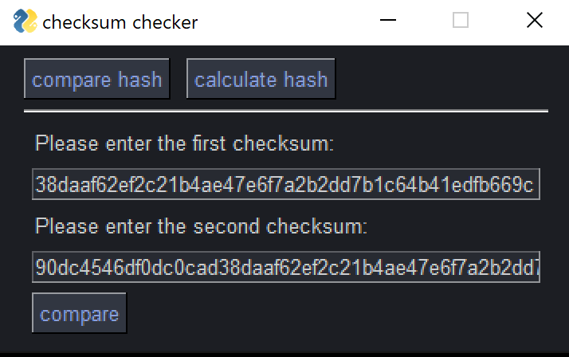

# checksumchecker

A small Python program that lets you easily calculate and compare checksums of downloaded files — all in one simple tool.

This script uses [PySimpleGUI](https://pypi.org/project/PySimpleGUI/) for a straightforward graphical interface.

## Supported hashing algorithms
- MD5  
- SHA1  
- SHA224  
- SHA256  
- SHA384  
- SHA512  

## Usage
Install the required dependencies:

```bash
pip install -r requirements.txt
```
Then run the script:
```bash
python checksumchecker.py
```


